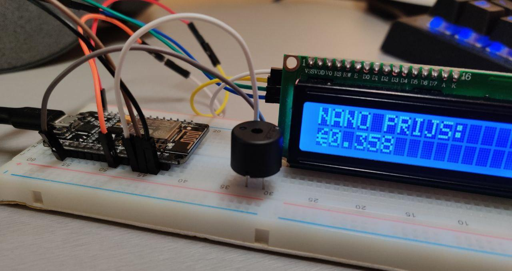
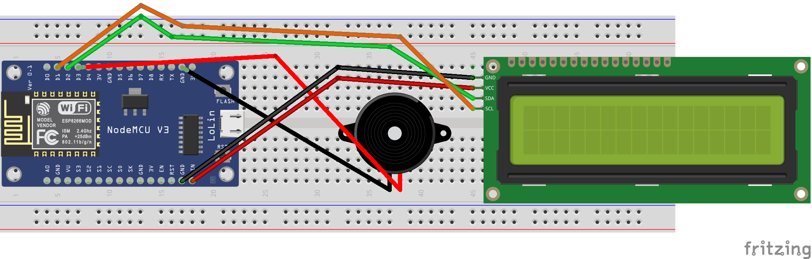

# ESP8266_LCD_CRYPTO_TICKER
Make a crypto ticker with the ESP8266. Scroll down for an explanation, how to make one yourself!

## Finished Product:

## Fritzing Schematic:

## Prerequisites:
First of all, you're going to need an ESP8266 board. They are available off of AliExpress for a decent price. You're also going to need a 16x2 LCD with preferably a header attached to the back, it saves you from soldering the pins. Jumper cables should be bought as well, and a breadboard. These are pretty self-explanatory. Adding a buzzer is optional. You'll also need to install some libraries, be sure to check the includes.

## Powered by CoinGecko API:
This project couldn't have been finished without CoinGecko's API. 
